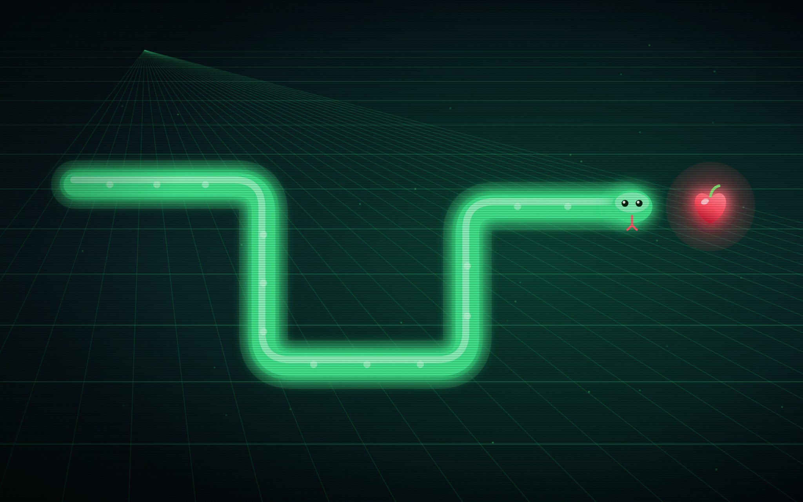
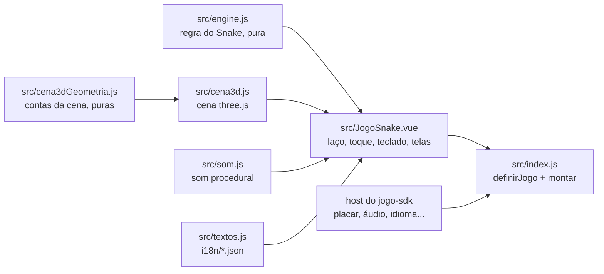

# Snake

O Snake do [RoqueOS](https://roqueos.com.br), em 3D: cresça a cobra comendo a gema, sem bater
nas paredes nem na própria cauda. Jogue em
[roqueos.com.br/jogar/snake](https://roqueos.com.br/jogar/snake).

_English below._

## Por que existe

Até 25/09/2026 este jogo morava dentro do repositório do RoqueOS e importava as stores do
sistema direto. Agora ele é um repo próprio na organização
[roqueos-games](https://github.com/roqueos-games), aberto, e fala com o RoqueOS só pelo
[`jogo-sdk`](https://github.com/roqueos-games/jogo-sdk). O mesmo código roda no RoqueOS,
sozinho no seu navegador (`yarn dev`) e no teste.

## Arquitetura

- `src/engine.js` é a regra do jogo, sem Vue, sem DOM e sem `Math.random`: a semente decide
  onde nasce a comida, então todo lance é reproduzível no teste.
- `src/cena3d.js` desenha o tabuleiro, a cobra e a gema com three.js, a partir de uma foto
  do estado do motor a cada quadro. `src/cena3dGeometria.js` guarda as contas (casa do
  tabuleiro para posição no mundo, linha central da cobra, enquadramento da câmera), puras
  e testadas sem WebGL.
- `src/JogoSnake.vue` roda o laço, ouve toque e teclado e mostra as telas por cima do
  canvas. Tudo o que vem do sistema (recorde da conta, áudio, perfil de aparelho fraco,
  métrica, avisos, idioma) chega pelo `host`.
- `src/index.js` cria um app Vue próprio dentro do elemento que o host entrega e devolve
  `{ ativar, desmontar }`.
- `jogo.json` é o manifesto: nome e descrição nos dez idiomas, SEO, etiquetas, capa, ícone,
  tamanho de janela e a chave do recorde. O RoqueOS confere que ele bate com o catálogo.

## three.js e o aparelho fraco

O jogo não traz three.js: ele é `peerDependency` (`^0.171.0`), e quem fornece é o RoqueOS.
No `yarn dev` e no teste vale a versão exata de `devDependencies`, a mesma do RoqueOS.

O perfil leve do host (`desempenho.modoLeve()`) desliga sombra, bloom, antialias e o brilho
da gema, e baixa o `pixelRatio`. Mudança em `src/cena3d.js` (renderizador, materiais,
luzes, sombras, pós-processamento, texturas) só entra com teste no iPhone de verdade: verde
no desktop não é verde no iPhone.

## Pré-requisitos

- Node 24 (o `.nvmrc` diz), ou 22 no mínimo.
- Yarn 1.22.

## Como rodar

1. `yarn install --ignore-scripts`
2. `yarn dev` e abra o endereço que o Vite mostrar: o jogo roda com o host de
   desenvolvimento do SDK, com o recorde no `localStorage`.
3. `yarn verificar` antes de abrir PR: lint, formato, testes e o `jogo check`, o mesmo que o
   CI roda.

## Estrutura

| Caminho              | O que é                                                                 |
| -------------------- | ----------------------------------------------------------------------- |
| `src/`               | o jogo (motor, cena 3D, tela, som, textos, entrada)                     |
| `i18n/`              | um JSON por idioma, com as mesmas chaves nos dez                        |
| `public/`            | capa e ícone; a origem de cada arquivo está no [ASSETS.md](ASSETS.md)   |
| `test/`              | testes com o host falso do SDK e um dublê do three, sem nada do RoqueOS |
| `dev/`, `index.html` | o jogo sozinho no navegador, para desenvolver                           |
| `jogo.json`          | o manifesto que o RoqueOS lê                                            |

## Onde ele se encaixa

O RoqueOS instala este repo por uma tag exata e monta o jogo pelo `mount` do SDK, na janela,
em `/jogar/snake` e no modo TV. Uma mudança aqui só chega ao RoqueOS quando uma tag nova é
pinada lá, depois de revisada. As chaves de armazenamento (`best`, `muted`, `seen`) e os nomes
de evento (`game_start`, `game_over`) não mudam: o recorde de quem já joga e o histórico de uso
dependem deles.

## Licença

MIT, no código e na arte própria. Veja [LICENSE](LICENSE) e [ASSETS.md](ASSETS.md).

---

## English

The 3D Snake game from [RoqueOS](https://roqueos.com.br). It talks to RoqueOS only through
the [`jogo-sdk`](https://github.com/roqueos-games/jogo-sdk), so the same code runs inside
RoqueOS, standalone in your browser and in tests.

- `yarn install --ignore-scripts`, then `yarn dev` to play it locally.
- `yarn verificar` runs lint, formatting, tests and `jogo check`, exactly like CI.
- three.js is a peer dependency provided by RoqueOS. Changes to the 3D scene
  (`src/cena3d.js`) need testing on a real iPhone before they ship.
- Code and comments are in Brazilian Portuguese; issues and pull requests in English are
  welcome.
- Storage keys (`best`, `muted`, `seen`) and event names (`game_start`, `game_over`) are
  stable on purpose: existing players' records and analytics depend on them.

MIT licensed, code and original art.
